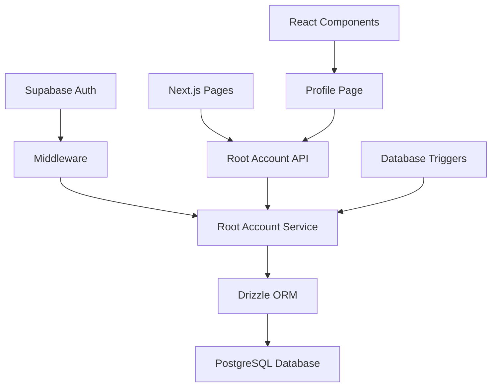

# 設計書

## 概要

ルートアカウント管理機能は、Supabaseの認証システムとアプリケーション固有のユーザー管理を連携させる機能です。認証されたユーザーのデータを自動的にコピーし、追加のプロフィール情報を管理できるようにします。

## アーキテクチャ

### システム構成



### データフロー

1. **認証時**: Supabase認証 → Middleware → Root Account Service → データベース更新
2. **プロフィール表示**: React Component → API Route → Service → データベース取得
3. **プロフィール更新**: Form Submit → API Route → Service → データベース更新

## コンポーネントとインターフェース

### 1. Root Account Service

**責務**: ルートアカウントのCRUD操作とビジネスロジック

```typescript
interface RootAccountService {
  // 認証ユーザーからルートアカウントを作成または更新
  createOrUpdateFromAuth(authUser: AuthUser): Promise<RootAccount>

  // ユーザーIDでルートアカウントを取得
  getByUserId(userId: string): Promise<RootAccount | null>

  // プロフィール情報を更新
  updateProfile(userId: string, profileData: ProfileUpdateData): Promise<RootAccount>

  // ログイン時刻を更新
  updateLastLogin(userId: string): Promise<void>
}
```

### 2. API Routes

**責務**: HTTPリクエストの処理とレスポンス

- `GET /api/profile` - プロフィール情報取得
- `POST /api/profile` - プロフィール情報更新
- `POST /api/profile/sync` - 認証データとの同期

### 3. React Components

**責務**: ユーザーインターフェースの表示と操作

- `ProfilePage` - プロフィール表示・編集ページ
- `ProfileForm` - プロフィール編集フォーム
- `ProfileDisplay` - プロフィール情報表示

### 4. Middleware

**責務**: 認証状態の確認とルートアカウント同期

```typescript
interface AuthMiddleware {
  // 認証状態を確認し、必要に応じてルートアカウントを同期
  checkAuthAndSync(request: NextRequest): Promise<NextResponse>
}
```

## データモデル

### RootAccount型定義

```typescript
interface RootAccount {
  // auth.usersから直接コピーするフィールド
  id: string
  aud?: string
  role?: string
  email?: string
  emailConfirmedAt?: Date
  phone?: string
  phoneConfirmedAt?: Date
  lastSignInAt?: Date
  rawAppMetaData?: Record<string, any>
  rawUserMetaData?: Record<string, any>
  isAnonymous: boolean

  // auth.usersの追加フィールド
  instanceId?: string
  emailChange?: string
  emailChangeTokenNew?: string
  emailChangeTokenCurrent?: string
  emailChangeSentAt?: Date
  phoneChange?: string
  phoneChangeToken?: string
  phoneChangeSentAt?: Date
  confirmationToken?: string
  confirmationSentAt?: Date
  recoveryToken?: string
  recoverySentAt?: Date
  emailChangeConfirmStatus?: number

  // アプリケーション固有フィールド
  isVerified: boolean
  motherTongueCode?: string
  siteLanguageCode?: string
  birthGeneration?: string
  totalPoints: number
  livingAreaSegment?: 'urban' | 'rural' | 'suburban'
  lastLoginAt?: Date
  warningCount: number
  lastWarningAt?: Date
  isAnonymousInitialAuth: boolean
  invitedAt?: Date
  confirmedAt?: Date
  bannedUntil?: Date
  isSuperAdmin?: boolean
  isSsoUser: boolean
  deletedAt?: Date
  createdAt: Date
  updatedAt: Date
}
```

### プロフィール更新データ

```typescript
interface ProfileUpdateData {
  motherTongueCode?: string
  siteLanguageCode?: string
  birthGeneration?: string
  livingAreaSegment?: 'urban' | 'rural' | 'suburban'
}
```

## エラーハンドリング

### エラー分類

1. **認証エラー**: 未認証ユーザーのアクセス
2. **データベースエラー**: 接続失敗、制約違反
3. **バリデーションエラー**: 不正な入力データ
4. **同期エラー**: 認証データとの同期失敗

### エラー処理戦略

```typescript
class RootAccountError extends Error {
  constructor(
    message: string,
    public code: 'AUTH_ERROR' | 'DB_ERROR' | 'VALIDATION_ERROR' | 'SYNC_ERROR',
    public statusCode: number = 500
  ) {
    super(message)
  }
}
```

### フォールバック動作

- 同期失敗時: 認証データから最小限のルートアカウントを作成
- データベース接続失敗時: キャッシュされたデータを使用
- バリデーションエラー時: 具体的なエラーメッセージを表示

## テスト戦略

### t-wadaが提唱するテスト駆動開発（TDD）の実践

1. **Red**: 失敗するテストを書く
2. **Green**: テストを通す最小限のコードを書く
3. **Refactor**: コードを改善する

### テスト分類

#### ユニットテスト
- RootAccountServiceの各メソッド
- バリデーション関数
- データ変換関数

#### 統合テスト
- API Routesのエンドポイント
- データベース操作
- 認証フロー

#### E2Eテスト
- ログインからプロフィール表示まで
- プロフィール編集フロー
- エラーハンドリング

### テストデータ管理

```typescript
// テスト用のモックデータ
const mockAuthUser = {
  id: 'test-user-id',
  email: 'test@example.com',
  // ...
}

const mockRootAccount = {
  id: 'test-user-id',
  email: 'test@example.com',
  isVerified: false,
  totalPoints: 0,
  // ...
}
```

## セキュリティ考慮事項

### Row Level Security (RLS)

```sql
-- ユーザーは自分のルートアカウントのみアクセス可能
CREATE POLICY "Users can only access their own root account"
ON root_accounts
FOR ALL
USING (auth.uid() = id);
```

### データ検証

- 入力データのサニタイゼーション
- SQLインジェクション対策
- XSS対策

### プライバシー保護

- 個人情報の最小化
- データの暗号化
- アクセスログの記録

## パフォーマンス最適化

### データベース最適化

- 適切なインデックスの設定
- クエリの最適化
- 接続プールの活用

### キャッシュ戦略

- プロフィールデータのメモリキャッシュ
- 静的データのCDN配信
- ブラウザキャッシュの活用

### レスポンス最適化

- 必要なデータのみ取得
- ページネーション
- 遅延読み込み
